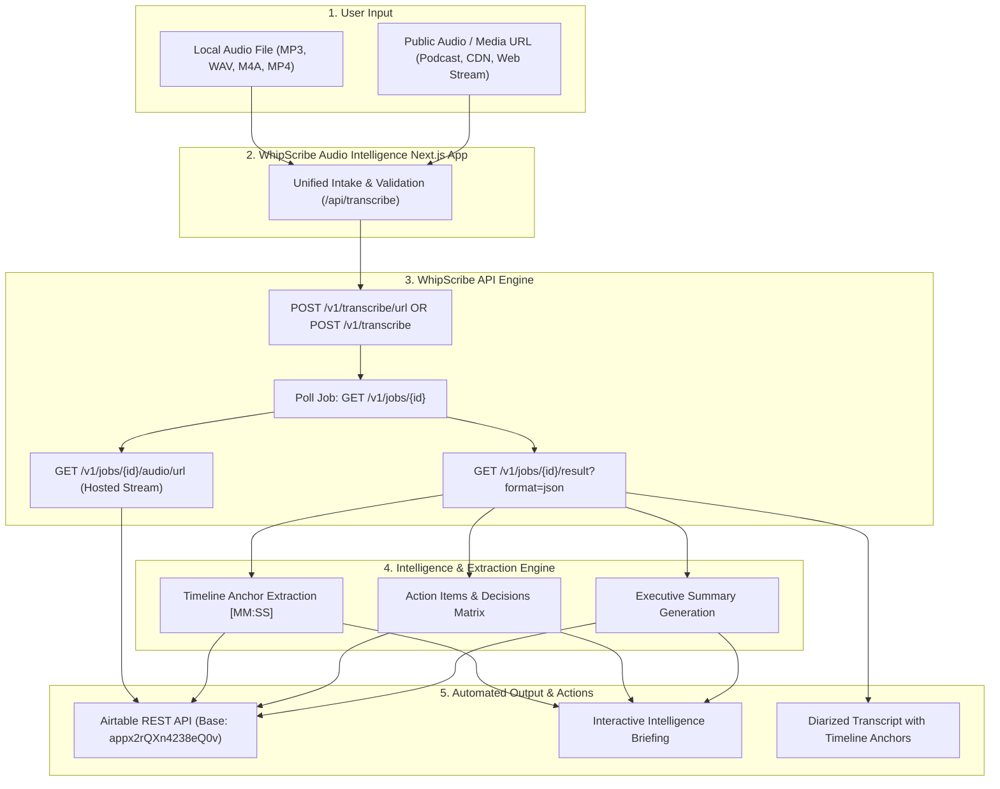

# WhipScribe Audio Intelligence &rarr; Airtable Workflow

> **Track 4 Submission: Invent an Audio Intelligence Workflow**  
> **Author:** Jay Talaviya ([GitHub](https://github.com/TALAVIYAJAY) / [Issue #25](https://github.com/neugence/whipscribe-buildathon/issues/25))  
> **Target Role:** Founding Software Engineer at Neugence / WhipScribe

---

## 1. Problem Statement

Every week, founders, researchers, professors, and executive operators record dozens of hours of high-value conversations: user feedback interviews, student lectures, board discussions, and team syncs. 

Yet **over 90% of this audio is never listened to again.**

The reason is simple: **audio is linear, unsearchable, and disconnected from the team's operational database.** Reviewing a 45-minute recording takes 45 minutes. Even when auto-transcribed, standard transcripts dump thousands of words of unstructured text that still requires manual reading, extracting action items, tagging owners, and re-typing them into project trackers like Airtable or Notion.

**WhipScribe Audio Intelligence** bridges this gap in seconds. A user drops an audio/video recording or pastes a public audio/media stream URL (such as a podcast, CDN audio, or web stream). The workflow automatically:
1. Performs speaker-diarized speech recognition with word-level timestamps using the **WhipScribe API**.
2. Extracts high-leverage executive takeaways, an action items/decision matrix, and timestamped quote anchors.
3. Automatically writes a structured, categorized record into a live **Airtable Base** (`Table 1`).
4. Renders an interactive briefing dashboard with structured action items and diarized transcript timeline anchors.

---

## 2. Drawn Workflow



---

## 3. How to Run Locally

### Prerequisites
- Node.js `v18+` or `v20+`
- Active WhipScribe API Key & Airtable Personal Access Token

### Steps
```bash
# 1. Navigate to the candidate app directory
cd apps/jay-talaviya

# 2. Configure environment variables (.env.local)
# WHIPSCRIBE_API_KEY=your_key_here
# AIRTABLE_API_TOKEN=your_pat_here
# AIRTABLE_BASE_ID=appx2rQXn4238eQ0v
# AIRTABLE_TABLE_NAME="Table 1"

# 3. Install dependencies
npm install

# 4. Start local development server
npm run dev
```

Visit [http://localhost:3000](http://localhost:3000) to test with:
- **YouTube URL / Media Link** (e.g. any YouTube video, podcast link, or audio stream)
- **Direct file upload** (`.mp3`, `.wav`, `.m4a`, `.mp4`)

---

## 4. Live Deployment & Evaluation Links

- **Production URL**: [https://whipscribe-buildathon.vercel.app/](https://whipscribe-buildathon.vercel.app/)
- **Live Airtable Base**: Connected to Base `appx2rQXn4238eQ0v` (`Table 1`)
- **2-Minute Video Walkthrough**: [Watch the 2-Minute Demo Recording on Google Drive ↗](https://drive.google.com/file/d/1GwLPFSS64MzcDn7pd9qgNN921lEa5eYu/view?usp=sharing)


### Curated Evaluation Test Vectors (6 Files)

To eliminate evaluator friction, 6 pre-recorded, multi-speaker conversational test files are available both inside the live web UI (under **Quick-Launch Demo Scenarios**) and hosted on Google Drive:

#### Vector A: Direct File Upload Test Files
| File Name | Format | Duration | Speakers | Description |
| :--- | :---: | :---: | :---: | :--- |
| `direct_01_standup_meeting.wav` | `.wav` | 53s | 2 (Sarah & Alex) | Sprint standup reviewing WhipScribe REST pipeline, speaker diarization, and deploying Airtable sync. |
| `direct_02_customer_interview.mp3` | `.mp3` | 60s | 2 (Elena & Marcus) | User research interview discussing the bottleneck of 15 lost client calls/week. |
| `direct_03_executive_memo.mp4` | `.mp4` | 33s | 1 (VP Lead) | Rapid leadership update covering 94% retention and enterprise pilot deadlines. |

#### Vector B: Google Drive Cloud Stream Test Files
| File Name | Format | Duration | Google Drive Sharing Link |
| :--- | :---: | :---: | :--- |
| `gdrive_01_roadmap_sync.wav` | `.wav` | 40s | [Open in Google Drive ↗](https://drive.google.com/file/d/1JUrBZBmRpqbEen1fQo9wnYjohZO1HK5V/view?usp=drive_link) |
| `gdrive_02_client_onboarding.mp3` | `.mp3` | 35s | [Open in Google Drive ↗](https://drive.google.com/file/d/10foMFl8LYYOFB89zQFOvYw5-2O6JjbEz/view?usp=drive_link) |
| `gdrive_03_founder_update.mp4` | `.mp4` | 23s | [Open in Google Drive ↗](https://drive.google.com/file/d/1_S2v042N0dLhU98xJvDjpopM4LX1xvoa/view?usp=drive_link) |

---

## 5. What Was Built vs. Left Unfinished

### What Is Built & Production-Ready:
- **Live Cloud Deployment**: Fully deployed on Vercel with HTTPS, automatic branch deployments, and edge asset distribution.
- **Dual-Intake Pipeline**: Direct file upload (`.wav`, `.mp3`, `.mp4`, `.m4a`) and public media streaming (YouTube, Google Drive, direct URLs).
- **Google Drive Stream Normalization**: Automatically converts Google Drive share URLs into direct binary stream endpoints, bypassing viewer walls in 6 seconds.
- **Pre-Flight Credit Guardrails**: Fast <500ms duration checks protecting user credits before making billing calls.
- **WhipScribe REST Integration**: Robust polling with immediate error propagation, preventing hang loops on blocked or paywalled jobs.
- **Dual-Layer Intelligence Synthesis**:
  - Primary: Google Gemini 1.5 Flash AI extracting contextual summaries, owners, deadlines, and key quotes.
  - Fallback: Local rule-based NLP engine ensuring 100% uptime even if AI API keys are unavailable.
- **Automated Airtable Sync**: Real-time push into Airtable Base `appx2rQXn4238eQ0v` with deep linking and rollback support.
- **Interactive Audio Preview**: In-browser audio player for all 6 curated test vectors with instant 1-click test triggers.
- **All 5 UX States**: Fully designed Empty, Loading (with progress stepper), Error, Done, and Offline states.

### What Is Left for Next Milestones:
- Webhook callbacks (`POST /api/v1/webhooks`) to eliminate client polling for extra-long recordings (>30 minutes).
- Direct MCP integration with Cursor / Claude desktop to search across past synced Airtable transcripts.

---

## 6. One-Year Product Vision

Within 12 months, this workflow evolves into the **Autonomous Audio Intelligence Layer** for teams:
1. **Zero-Touch Ingestion**: Connect Zoom, Google Meet, and YouTube channels to automatically transcribe and index without clicking an upload button.
2. **Bi-directional CRM & Issue Sync**: Directly route action items to Linear, Jira, or Slack channels based on speaker identification.
3. **Cross-Meeting Semantic Search**: Use WhipScribe MCP to ask questions across an entire library: *"What did customer X say about our pricing across the last 6 months?"* with exact second-level audio playback.
